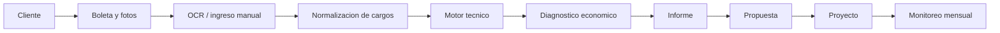

# Arquitectura tecnica

## Capas

1. UI web responsive en Next.js App Router.
2. API routes para el MVP.
3. Dominio energetico puro en `src/domain/energy`.
4. Dominio financiero en `src/domain/finance`.
5. Persistencia Postgres via Prisma.
6. Storage externo para boletas, fotos y evidencias.
7. OCR como integracion asincrona.

## Flujo principal

## Decision MVP

El repositorio incluye un repositorio temporal en memoria para que las rutas funcionen durante el desarrollo inicial. La fuente de verdad esperada en produccion es Prisma/PostgreSQL. Esto permite avanzar UI, API y reglas sin bloquearse por infraestructura.

## Motor de reglas

El calculo inicial evalua:

- Porcentaje de energia sobre total.
- Porcentaje de potencia sobre total.
- Porcentaje de multa reactiva sobre total.
- Cargos no clasificados.
- Score de oportunidad.
- Recomendaciones priorizadas.
- Trazabilidad de reglas y supuestos.

La estimacion es preliminar y debe confirmarse con medicion o visita tecnica antes de prometer ahorros.
